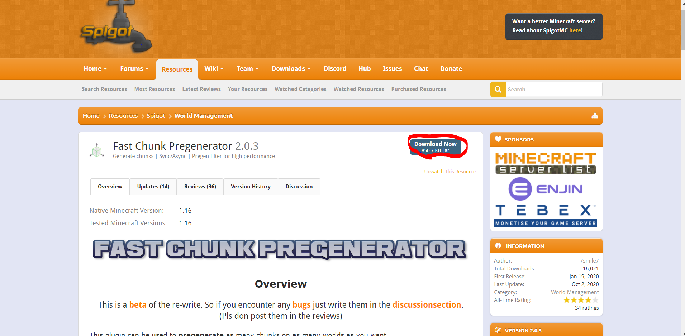

# How to install and use [Fast Chunk Pregenerator](https://www.spigotmc.org/resources/fast-chunk-pregenerator.74429/)

## What is Fast Chunk Pregenerator?

Fast Chunk Pregenerator, or FCP, is a plugin that generates chunks of your world so it doesn't have to generate new chunks while people are exploring. It helps with server lag because generating new chunks takes up a lot of server resources. 

## Prerequisites

You need a server running which can handle Spigot plugins (for example Spigot, Paper or Purpur; look [here](../../../info/en_us/SERVER_JARS.md) for a further description of the servers)

Now what you need to do is download FCP. Go to [the Spigot Page](https://www.spigotmc.org/resources/fast-chunk-pregenerator.74429/) and click on `Download Now`

[](https://www.spigotmc.org/resources/fast-chunk-pregenerator.74429/)

## Installation

Move (or copy) the downloaded JAR into the plugins directory `/plugins/` in your server directory (where the Server JAR is).

Now restart your server (do `/restart` or do `/stop` and start it again).


## Using FCP

### Getting Started

Note: Never use this plugin while people are playing on your server, it causes extreme lag. Don't worry, the lag is normal as it's generating lots of chunks.

To use these commands you either need access to the console, have operator or have the `fcp.commands` permission.

To get started, go to the server console and type `/fcp start <radius> [world] [chunkX] [chunkZ]`. 
- `radius` is how many blocks outwards you want to be generated. 
- `world` is what world you want to be generated, works with custom worlds with multiverse and similar plugins. 
- `chunkX` is the X coordinate you want the generation to start on. 
- `chunkZ` is the Z coordinate you want the generation to start on.

Once you have run the command it will start generating the chunks, all you have to do now is wait. It may take a long time if you are generating thousands of blocks outwards.

### Pause, Resume and Cancel Generation Tasks

FCP has some useful commands that allow you to pause, resume and cancel generation tasks. 

| Task                 | Command       | Function|
|----------------------|---------------|---------|
| Pausing Generation   | `/fcp pause`  |Pauses the current generation task.|
| Resuming Generation  | `/fcp resume` |Pauses the current generation task.|
| Canceling Generation | `/fcp cancel` |Cancels the current generation task.|

### Pending Generation Tasks

You can have a queue of generation tasks by running the command in [Getting Started](FAST_CHUNK_PREGENERATOR.md#getting_started) multiple times. 

To view the pending generation task run the command `/fcp pending`

## Config


```
# Max milliseconds the generation thread should take per tick.
# Increase for more chunks per tick and less TPS
# Should be below 35 if async.
MaxMillisPerTick: 28.5

# Amount of ticks to wait between generations.
WaitTicksBetween: 0
 
# Only enable on Paper.
AsyncChunkLoadingEnabled: false

# Increases chunk priority.
# This could prevent loading of chunks that
# players may need but could also increase generation speed.
# Disable if you want steady generations.
HighAsyncPriority: true

# Experimental. Disable for now.
UnsafeAsyncCalls: false

# Only usefull when using AsyncChunkLoading
# A good value is 4 * CPU core count for exampe.
MaxParallelAsyncCalls: 8
 
# How many seconds to wait between each notification.
SecondsPerNotification: 5
 
# The progess output. Can be one of:
# NONE, CONSOLE, BROADCAST, OP, OP_AND_CONSOLE
NotificationType: CONSOLE

# Pauses generation if a player logs in
# and resumes when the last one logs out
OnlyGenerateWithNoPlayersOnline: false
```

- MaxMillisPerTick - This is the max milliseconds the generation thread should take per tick. Increase the number for more chunks generated per tick and less TPS. Should be below 35 if async.  
Default: 28.5

- WaitTicksBetween - Amount of ticks to wait between generations.  
Default: 0

- AsyncChunkLoadingEnabled: Whether async chunk loading is enabled, only use if your using paper or a paper fork.  
Default: false

- HighAsyncPriority - Increases chunk priority. Could prevent the loading of chunks that players need but also could increase generation speed. Disable for steady generations.  
Default: true

- UnsafeAsyncCalls - Experimental setting, disable.  
Default: false

- MaxParallelAsyncCalls - Only useful when using AsyncChunkLoading. A good value is 4 * CPU core count.  
Default: 8

- SecondsPerNotification - Seconds between generation notifications.  
Default: 5

- NotificationType - Notification type, NONE (No notifications), CONSOLE (Notify console), BROADCAST (Notify everyone on the server), OP (Notify players with OP) or OP_AND_CONSOLE (Notify both the console and players with OP).  
Default: CONSOLE

- OnlyGenerateWithNoPlayersOnline - Generates chunks only when no players are online, if someone joins it will pause the generation and when they leave it will resume.
