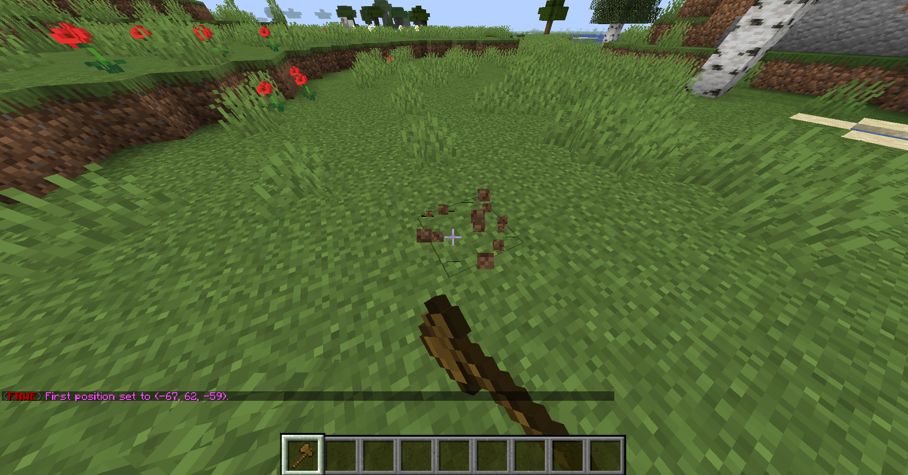
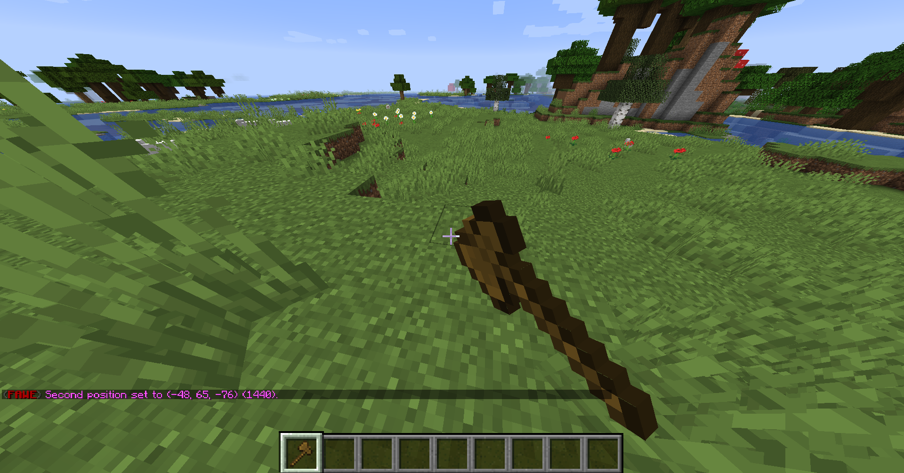
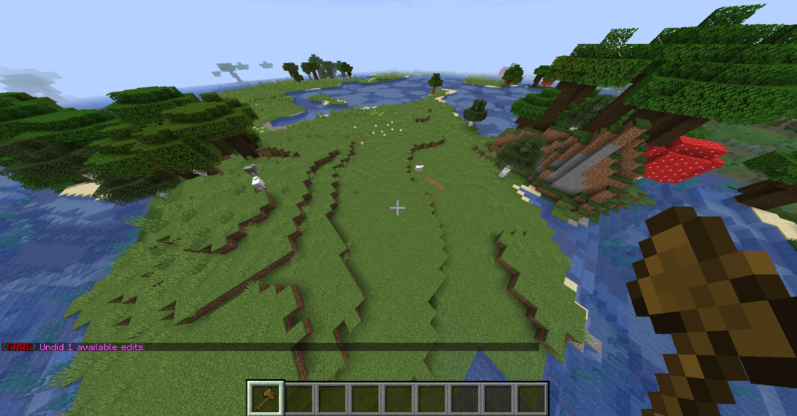

# How to install and use [Fast Async World Edit (FAWE)](https://www.spigotmc.org/resources/fast-async-worldedit.13932/)

## What is FAWE?

WorldEdit is a plugin for building structures more quickly. For example, building a sphere, pyramid, or filling a cuboid. FAWE is a fork of WorldEdit and which has huge speed and memory improvements and considerably more features

## Prerequisites

Warning: FAWE needs [Nashorn](https://openjdk.java.net/projects/nashorn/) which was removed in Java 15 for some features. FAWE recommends using version 11.

You need a server running which can handle Spigot plugins (for example Spigot, Paper or Purpur; look [here](../../../info/en_us/SERVER_JARS.md) for a further description of the servers)

The first thing to do is to download FAWE. Go to [the Spigot Page](https://www.spigotmc.org/resources/fast-async-worldedit.13932/) and click on `Download Now`

[](https://www.spigotmc.org/resources/fast-async-worldedit.13932/)

Now you should be on FAWE's Jenkins site. Click on the JAR under `Last successful artifacts` and it should be downloaded.

[](https://ci.athion.net/job/FastAsyncWorldEdit-1.16/)

Note: There's also a direct link to the [last stable build](https://ci.athion.net/job/FastAsyncWorldEdit-1.16/lastStableBuild/)

## Installation

Move (or copy) the downloaded JAR into the plugins directory in your server directory (where the Server JAR is)

Now restart your server (do `/restart` or do `/stop` and start it again).

Note: You can also do `/reload` but that is not recommended and can cause bugs and memory leak

You should see something like this in your server logs:

```
[15:04:57 INFO]: [FastAsyncWorldEdit] Enabling FastAsyncWorldEdit v1.16-581;dd65cff
[15:04:57 INFO]: WEPIF: Using the Bukkit Permissions API.
[15:04:58 INFO]: Using com.sk89q.worldedit.bukkit.adapter.impl.FAWE_Spigot_v1_16_R3 as the Bukkit adapter
[15:04:58 INFO]: Registering commands with com.sk89q.worldedit.bukkit.BukkitServerInterface
```

## Using FAWE

### Getting Started

To do stuff with FAWE you need the so-called wand. Normally, that's a wooden axe, so just grab one out of your inventory or do `//wand`. FAWE's commands always start with two slashes and not just one and FAWE often needs two positions for stuff, for example, for filling a cuboid, it needs two of the corners.


### Filling an cuboid

Select the two corners by leftclicking on one corner block and rightclicking on another corner block





Note: The `1440` means that 1440 blocks are selected.

Now you fill it, for example, with stone so do `//set stone`


### Undoing

If you did something wrong, don't worry, just do `//undo`



### Further commands
For a command list do `//help` or go [here](https://wiki.intellectualsites.com/FastAsyncWorldEdit/Commands)
